# Bharat Kaushal — Real-Time Cooperative Task Platform
## Complete Project Documentation & System Design

---

# Table of Contents

1. [Project Overview](#1-project-overview)
2. [Complete Tech Stack](#2-complete-tech-stack)
3. [Frontend Architecture](#3-frontend-architecture)
4. [Backend Architecture](#4-backend-architecture)
5. [Frontend–Backend Connection](#5-frontendbackend-connection)
6. [Authentication System](#6-authentication-system)
7. [API Endpoints Reference](#7-api-endpoints-reference)
8. [Data Flow Explanation](#8-data-flow-explanation)
9. [Use Case Diagram](#9-use-case-diagram)
10. [Data Flow Diagram (DFD)](#10-data-flow-diagram-dfd)
11. [Entity Relationship Diagram (ERD)](#11-entity-relationship-diagram-erd)
12. [Activity Diagrams](#12-activity-diagrams)
13. [Database Diagram (SQL Design)](#13-database-diagram-sql-design)
14. [Sequence Diagrams](#14-sequence-diagrams)

---

# 1. Project Overview

**Bharat Kaushal** is a full-stack, real-time cooperative labour marketplace platform built for India's cooperative workforce ecosystem. It connects **Customers** who need home services (plumbing, electrical, carpentry, etc.) with **Verified Cooperative Workers (Craftsmen)** — all governed by a transparent cooperative policy managed by **Society Admins**, **Federation Command Officers**, and **Government Super Admins**.

### What Makes It Unique
- **Cooperative Model**: Workers keep 94.5% of earnings (vs. 70–80% on Uber/Urban Company). Only 3.5% goes to the local cooperative society and 2% to a welfare fund.
- **Real-Time Sync**: Every action (booking, tracking, payments, OTP verification) is synchronized across all connected devices using **WebSockets**.
- **5-Role Hierarchy**: Customer → Worker → Society Admin → Federation Command → Super Admin (Government).
- **AI-Powered**: Gemini AI detects worker trades and auto-classifies skills from descriptions.
- **No External Database**: Uses an in-memory authoritative data store on the server for the demo (designed to be replaced with SQL/NoSQL in production).

---

# 2. Complete Tech Stack

| Layer | Technology | Purpose |
|-------|-----------|---------|
| **Frontend Framework** | React 19 + TypeScript | Component-based UI with type safety |
| **Build Tool** | Vite 6 | Ultra-fast HMR dev server & production bundler |
| **Styling** | TailwindCSS 4 | Utility-first CSS framework |
| **Animations** | Motion (Framer Motion) | Smooth UI transitions and micro-interactions |
| **Icons** | Lucide React | Modern SVG icon library |
| **Charts** | Recharts | Data visualization for admin dashboards |
| **Maps** | Leaflet + Geoapify | Live GPS tracking maps with tile layers |
| **Backend Runtime** | Node.js + Express 4 | REST API server |
| **TypeScript Runner** | tsx | Runs TypeScript server directly (no compile step) |
| **WebSockets** | ws (WebSocket library) | Real-time bidirectional communication |
| **Authentication** | Firebase Auth (Google OAuth) | Google Sign-In with access token + Gmail API |
| **Email Service** | Gmail API | Sends invoice emails via authenticated Google account |
| **AI/ML** | Google Gemini 2.5 Flash | AI-based worker trade/field detection |
| **Environment Config** | dotenv | Manages API keys and secrets |
| **Production Bundler** | esbuild | Bundles server.ts for production deployment |
| **Internationalization** | Custom i18n engine | 12+ Indian language translations |
| **State Management** | React Context API | Global state via AuthContext + RealtimeContext |

---

# 3. Frontend Architecture

> **In simple words**: The frontend is a React app that shows different portals based on who logs in. Everything updates in real-time because it's always connected to the server via WebSocket.

## 3.1 Entry Point Flow

```
index.html → main.tsx → App.tsx → Providers → MainAppContent
```

- `index.html` loads the anti-flash theme script and mounts the React root
- `main.tsx` renders `<App />` inside React's `<StrictMode>`
- `App.tsx` wraps everything in two context providers:

```
<ErrorBoundary>
  <AuthProvider>          ← Manages all 5 role sessions
    <RealtimeProvider>    ← WebSocket + all real-time state
      <MainAppContent />  ← Conditional rendering based on auth state
    </RealtimeProvider>
  </AuthProvider>
</ErrorBoundary>
```

## 3.2 Component Hierarchy



<details>
<summary>▶ Click to inspect Mermaid source definition</summary>

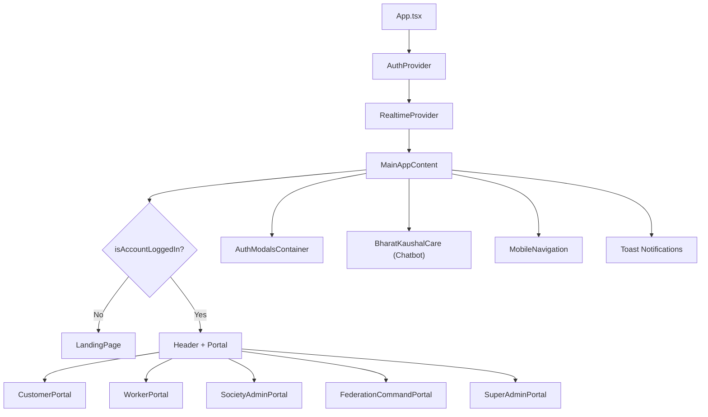
```mermaid
graph TD
    A["App.tsx"] --> B["AuthProvider"]
    B --> C["RealtimeProvider"]
    C --> D["MainAppContent"]
    D --> E{"isAccountLoggedIn?"}
    E -->|No| F["LandingPage"]
    E -->|Yes| G["Header + Portal"]
    G --> H["CustomerPortal"]
    G --> I["WorkerPortal"]
    G --> J["SocietyAdminPortal"]
    G --> K["FederationCommandPortal"]
    G --> L["SuperAdminPortal"]
    D --> M["AuthModalsContainer"]
    D --> N["BharatKaushalCare (Chatbot)"]
    D --> O["MobileNavigation"]
    D --> P["Toast Notifications"]
```
</details>

## 3.3 How Each Frontend Technology Is Used

### React 19
- **Components**: Every UI section (CustomerPortal, WorkerPortal, Header, etc.) is a React functional component
- **Hooks**: `useState`, `useEffect`, `useContext`, `useCallback`, `useRef` manage local/global state
- **Context API**: Two global contexts (`AuthContext`, `RealtimeContext`) provide state to all child components without prop drilling

### TypeScript
- Every file uses `.tsx` extension
- All data models are defined as TypeScript `interfaces` and `types` in `src/types/index.ts`
- Strict typing ensures type safety across 50+ components

### Vite 6
- Configured in `vite.config.ts` with React and TailwindCSS plugins
- Runs in middleware mode inside the Express server during development (so both frontend HMR and backend API share the same port)
- Produces optimized production bundles via `vite build`

### TailwindCSS 4
- All styling is utility-first (e.g., `className="bg-blue-600 text-white rounded-xl p-4"`)
- Custom theme extensions and dark mode support in `index.css`

### Leaflet + Geoapify
- Used in `GeoapifyWorkerMap.tsx` and `WorkerJobMap.tsx` for interactive maps
- Shows worker live location, customer location markers, and route visualization
- Geoapify provides tile layers (map backgrounds) via API key

### Recharts
- Used in `FederationDataVisualization.tsx` for admin dashboards
- Renders bar charts, line charts, and pie charts for demand forecasting, revenue splits, and worker stats

### Motion (Framer Motion)
- Provides smooth page transitions, modal animations, and micro-interactions
- Used for hover effects, slide-in panels, and animated toasts

### Lucide React
- Provides 200+ SVG icons used throughout the UI (e.g., `ShieldCheck`, `Zap`, `Users`, `IndianRupee`)

---

# 4. Backend Architecture

> **In simple words**: The backend is a single Node.js + Express server that stores all data in memory (arrays and objects), exposes REST API endpoints, and broadcasts every change to all connected browsers via WebSocket.

## 4.1 Server Structure



<details>
<summary>▶ Click to inspect Mermaid source definition</summary>

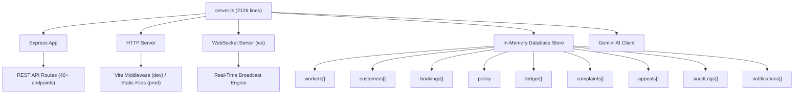
```mermaid
graph TD
    A["server.ts (2126 lines)"] --> B["Express App"]
    A --> C["HTTP Server"]
    A --> D["WebSocket Server (ws)"]
    B --> E["REST API Routes (40+ endpoints)"]
    C --> F["Vite Middleware (dev) / Static Files (prod)"]
    D --> G["Real-Time Broadcast Engine"]
    A --> H["In-Memory Database Store"]
    A --> I["Gemini AI Client"]
    H --> J["workers[]"]
    H --> K["customers[]"]
    H --> L["bookings[]"]
    H --> M["policy"]
    H --> N["ledger[]"]
    H --> O["complaints[]"]
    H --> P["appeals[]"]
    H --> Q["auditLogs[]"]
    H --> R["notifications[]"]
```
</details>

## 4.2 How Each Backend Technology Is Used

### Express 4
- Creates the HTTP server and defines 40+ REST API routes
- Handles JSON request parsing via `express.json()` middleware
- Serves static files in production from the `dist/` folder

### ws (WebSocket)
- Creates a WebSocket server at path `/ws` attached to the HTTP server
- Tracks all connected clients in a `Set<WebSocket>`
- On new connection: sends full `INIT_STATE` payload (all data)
- On any data mutation (booking, payment, etc.): broadcasts the change event to ALL clients

### tsx
- Runs `server.ts` directly without compiling to JavaScript first
- Used in `npm run dev` script: `tsx server.ts`

### dotenv
- Loads `.env` file to read `GEMINI_API_KEY`, `PORT`, and `VITE_GEOAPIFY_API_KEY`

### Gemini AI (Google GenAI SDK)
- Used in the `/api/worker/detect-field` endpoint
- When a worker enters their skills and work description, Gemini classifies them into a standard trade (Plumbing, Electrical, etc.)
- Falls back to a deterministic keyword rule engine if Gemini is unavailable

### esbuild
- Used in `npm run build` to bundle `server.ts` into `dist/server.cjs` for production deployment

---

# 5. Frontend–Backend Connection

> **In simple words**: The frontend talks to the backend in two ways — HTTP requests (for actions like creating a booking) and WebSocket (for getting instant updates without refreshing the page).

## 5.1 Dual Communication Architecture



<details>
<summary>▶ Click to inspect Mermaid source definition</summary>

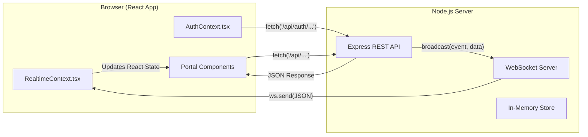
```mermaid
graph LR
    subgraph Browser ["Browser (React App)"]
        RC["RealtimeContext.tsx"]
        AC["AuthContext.tsx"]
        UI["Portal Components"]
    end
    subgraph Server ["Node.js Server"]
        REST["Express REST API"]
        WS["WebSocket Server"]
        DB["In-Memory Store"]
    end
    
    UI -->|"fetch('/api/...')"| REST
    REST -->|JSON Response| UI
    REST -->|"broadcast(event, data)"| WS
    WS -->|"ws.send(JSON)"| RC
    RC -->|"Updates React State"| UI
    AC -->|"fetch('/api/auth/...')"| REST
```
</details>

## 5.2 How It Works Step-by-Step

1. **On Page Load**: `RealtimeContext.tsx` opens a WebSocket connection to `ws://localhost:3001/ws`
2. **Server sends INIT_STATE**: The server sends the entire current state (workers, bookings, policy, etc.) to the new client
3. **User Performs Action**: E.g., clicks "Book Service" → triggers `createBooking()` in `RealtimeContext`
4. **HTTP Request**: `createBooking()` sends a `POST /api/bookings` request to the Express server
5. **Server Processes**: Creates the booking, runs the dispatch algorithm, assigns a worker
6. **Server Broadcasts**: Calls `broadcast('BOOKING_CREATED', newBooking)` which sends the event to ALL WebSocket clients
7. **All Clients Update**: Every connected browser receives the WebSocket message and updates their React state automatically
8. **UI Re-renders**: React re-renders the relevant components showing the new booking

### Connection Resilience
The WebSocket connection includes:
- **Exponential backoff** reconnection (up to 50 retries)
- **Heartbeat ping/pong** every 25 seconds to keep connections alive
- **Auto-reconnect** when the browser tab becomes visible again or the network comes back online

---

# 6. Authentication System

> **In simple words**: The project uses two authentication mechanisms — Firebase Google OAuth (for Gmail email sending) and a custom in-memory session system (for the 5 role-based logins).

## 6.1 Authentication Flow



<details>
<summary>▶ Click to inspect Mermaid source definition</summary>

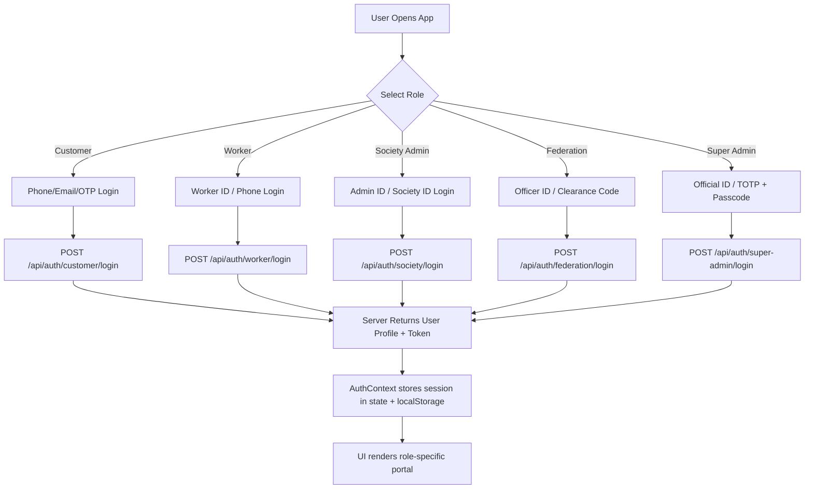
```mermaid
graph TD
    A["User Opens App"] --> B{"Select Role"}
    B -->|Customer| C["Phone/Email/OTP Login"]
    B -->|Worker| D["Worker ID / Phone Login"]
    B -->|Society Admin| E["Admin ID / Society ID Login"]
    B -->|Federation| F["Officer ID / Clearance Code"]
    B -->|Super Admin| G["Official ID / TOTP + Passcode"]
    
    C --> H["POST /api/auth/customer/login"]
    D --> I["POST /api/auth/worker/login"]
    E --> J["POST /api/auth/society/login"]
    F --> K["POST /api/auth/federation/login"]
    G --> L["POST /api/auth/super-admin/login"]
    
    H --> M["Server Returns User Profile + Token"]
    I --> M
    J --> M
    K --> M
    L --> M
    
    M --> N["AuthContext stores session in state + localStorage"]
    N --> O["UI renders role-specific portal"]
```
</details>

## 6.2 Technologies Used for Authentication

| Component | Technology | How It's Used |
|-----------|-----------|---------------|
| **Role-Based Login** | Custom Express API + React Context | 5 separate login endpoints, each validates against in-memory user arrays |
| **Session Persistence** | `localStorage` | Auth state is saved to `bk_auth_customer_logged_in`, `bk_auth_worker`, etc. |
| **Token Generation** | Custom string tokens | Server generates tokens like `cust_token_BH-KAUSHAL-CUST-000042_1726412345000` |
| **Email Verification** | OTP via `/api/auth/email/send-otp` | 6-digit OTP stored in server-side `Map`, verified via `/api/auth/email/verify-otp` |
| **Google OAuth** | Firebase Auth (`signInWithPopup`) | Used specifically for Gmail API access to send invoice emails |
| **Gmail API** | `gmail.ts` + OAuth Access Token | Sends HTML invoice emails via `POST https://gmail.googleapis.com/gmail/v1/users/me/messages/send` |
| **MFA Simulation** | TOTP/Hardware Key fields | Super Admin login accepts TOTP codes (demo accepts any) |

---

# 7. API Endpoints Reference

> **In simple words**: These are all the URLs the frontend calls to perform actions. Each URL is like a function on the server that does something specific.

## Health & Utility
| Method | Endpoint | Purpose |
|--------|----------|---------|
| GET | `/api/health` | Server health check with connected clients count |
| GET | `/api/dataset.csv` | Download the Indore services dataset CSV |

## Authentication (5 Roles)
| Method | Endpoint | Purpose |
|--------|----------|---------|
| POST | `/api/auth/customer/login` | Customer login (phone/email/ID) |
| POST | `/api/auth/customer/register` | Register new customer |
| POST | `/api/auth/worker/login` | Worker login (ID/phone) |
| POST | `/api/auth/worker/register` | Register new worker with full profile |
| POST | `/api/auth/society/login` | Society Admin login |
| POST | `/api/auth/federation/login` | Federation Admin login |
| POST | `/api/auth/super-admin/login` | Super Admin login (with clearance) |
| POST | `/api/auth/super-admin/register` | Register new Super Admin official |
| GET | `/api/auth/accounts` | List all demo accounts for role switching |

## Email Verification
| Method | Endpoint | Purpose |
|--------|----------|---------|
| POST | `/api/auth/email/send-otp` | Send 6-digit OTP to email |
| POST | `/api/auth/email/verify-otp` | Verify OTP and mark email as verified |
| POST | `/api/auth/email/unlink` | Unlink verified email from profile |

## Workers
| Method | Endpoint | Purpose |
|--------|----------|---------|
| GET | `/api/workers` | List all workers |
| GET | `/api/workers/:id` | Get single worker profile |
| PUT | `/api/workers/:id` | Update worker profile |
| POST | `/api/workers/register` | 6-step worker registration |
| POST | `/api/workers/:id/verify` | Admin approves/rejects worker |
| POST | `/api/workers/:id/availability` | Toggle worker availability |
| POST | `/api/worker/check-mobile` | Check if phone already registered |
| POST | `/api/worker/detect-field` | AI trade detection (Gemini + rules) |
| POST | `/api/worker/generate-assessment` | Generate 15 skill test questions |
| POST | `/api/worker/submit-assessment` | Grade and score the assessment |

## Customers
| Method | Endpoint | Purpose |
|--------|----------|---------|
| PUT | `/api/customers/:id` | Update customer profile |
| POST | `/api/customers/:id/addresses` | Add/update customer address |

## Services
| Method | Endpoint | Purpose |
|--------|----------|---------|
| GET | `/api/services` | List services (filter by category/search) |
| PUT | `/api/services/:id` | Update service config (multi-worker rules) |

## Bookings (Full Lifecycle)
| Method | Endpoint | Purpose |
|--------|----------|---------|
| GET | `/api/bookings` | List all bookings |
| GET | `/api/bookings/:id` | Get single booking |
| POST | `/api/bookings` | Create booking + run fair dispatch |
| POST | `/api/bookings/:id/accept` | Worker accepts the job |
| POST | `/api/bookings/:id/start-journey` | Worker starts travelling |
| POST | `/api/bookings/:id/update-location` | GPS location update |
| POST | `/api/bookings/:id/arrived` | Worker marks arrival |
| POST | `/api/bookings/:id/verify-arrival-otp` | Customer OTP verification at door |
| POST | `/api/bookings/:id/request-material` | Worker requests extra charges |
| POST | `/api/bookings/:id/respond-material` | Customer approves/rejects charges |
| POST | `/api/bookings/:id/complete` | Worker marks job done |
| POST | `/api/bookings/:id/verify-completion-otp` | Final OTP → triggers payment settlement |
| POST | `/api/bookings/:id/pay` | Customer pays (UPI/Card/Cash) |
| GET | `/api/bookings/:id/invoice` | Get generated invoice |
| POST | `/api/bookings/:id/rate` | Customer rates worker |
| POST | `/api/bookings/:id/cancel` | Cancel booking + penalty calculation |

## Support & Governance
| Method | Endpoint | Purpose |
|--------|----------|---------|
| POST | `/api/complaints` | Submit support ticket |
| POST | `/api/complaints/:id/resolve` | Admin resolves complaint |
| POST | `/api/appeals` | Worker submits penalty appeal |
| POST | `/api/appeals/:id/decide` | Admin approves/rejects appeal |
| POST | `/api/sos` | Emergency SOS trigger |
| GET | `/api/policies` | Get cooperative policy config |
| POST | `/api/policies` | Update cooperative policy |
| POST | `/api/chat` | AI chatbot response |
| POST | `/api/demo/reset` | Reset all data to seed state |

---

# 8. Data Flow Explanation

> **In simple words**: Data flows in a loop — the user does something on the frontend, it goes to the server, the server processes it and saves it in memory, then broadcasts the result back to ALL connected users instantly.

## 8.1 High-Level Data Flow



<details>
<summary>▶ Click to inspect Mermaid source definition</summary>

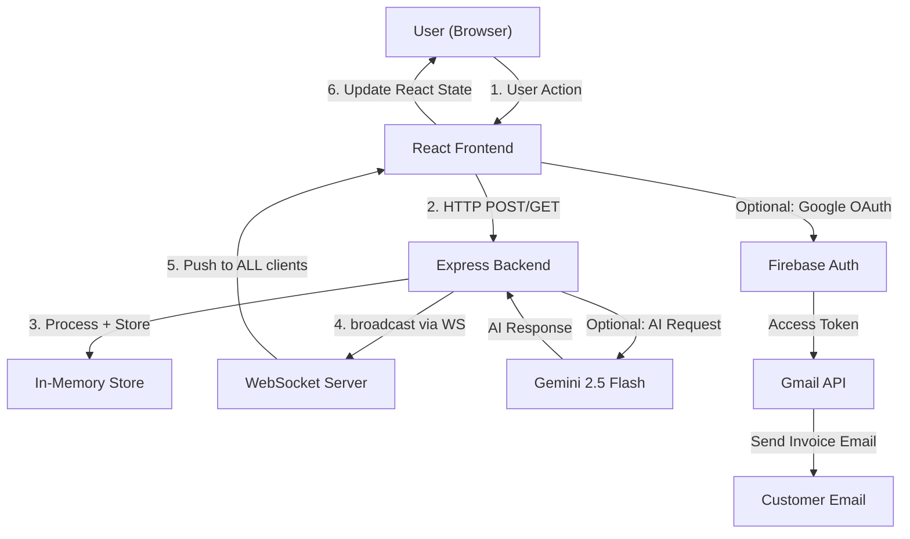
```mermaid
graph TD
    U["User (Browser)"] -->|1. User Action| FE["React Frontend"]
    FE -->|2. HTTP POST/GET| BE["Express Backend"]
    BE -->|3. Process + Store| DB["In-Memory Store"]
    BE -->|4. broadcast via WS| WS["WebSocket Server"]
    WS -->|5. Push to ALL clients| FE
    FE -->|6. Update React State| U
    
    BE -->|"Optional: AI Request"| AI["Gemini 2.5 Flash"]
    AI -->|"AI Response"| BE
    
    FE -->|"Optional: Google OAuth"| FB["Firebase Auth"]
    FB -->|"Access Token"| GM["Gmail API"]
    GM -->|"Send Invoice Email"| EMAIL["Customer Email"]
```
</details>

## 8.2 Booking Data Flow (Detailed)

1. **Customer selects service** → Frontend calls `POST /api/bookings` with service ID, address, and scope details
2. **Server calculates worker requirement** → Runs `calculateWorkerRequirement()` engine
3. **Server calculates pricing** → Runs `calculateServiceBookingPricing()` with cooperative policy splits
4. **Server finds available team** → Runs `findAvailableTeamForService()` matching skills, distance, trust score
5. **Server creates booking** → Stores in `bookings[]` array with status `WORKER_OFFERED`
6. **Server broadcasts** → `BOOKING_CREATED` and `WORKER_OFFERED` events sent to all clients
7. **Worker's portal updates** → Shows new job offer with accept button
8. **Worker accepts** → `POST /api/bookings/:id/accept` → generates arrival OTP → broadcasts `WORKER_ACCEPTED`
9. **Lifecycle continues** → Through travelling → arrived → OTP verified → in-progress → completion OTP → payment → rating

---

# 9. Use Case Diagram

> **In simple words**: This shows what each type of user can do in the system.


<details>
<summary>▶ Click to inspect Mermaid source definition</summary>

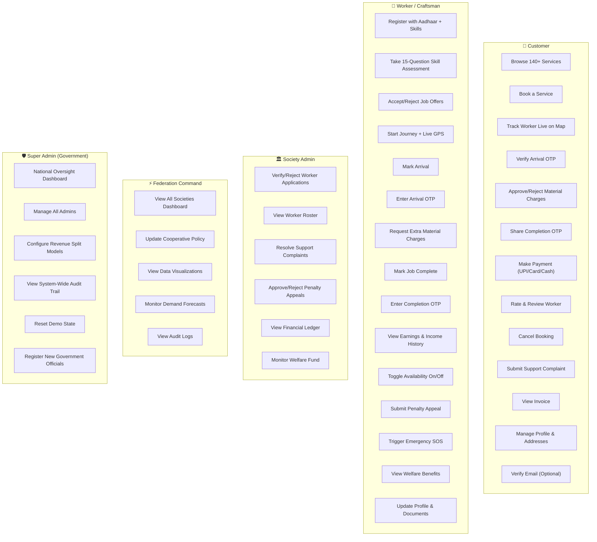
```mermaid
graph TD
    subgraph Customer ["👤 Customer"]
        C1["Browse 140+ Services"]
        C2["Book a Service"]
        C3["Track Worker Live on Map"]
        C4["Verify Arrival OTP"]
        C5["Approve/Reject Material Charges"]
        C6["Share Completion OTP"]
        C7["Make Payment (UPI/Card/Cash)"]
        C8["Rate & Review Worker"]
        C9["Cancel Booking"]
        C10["Submit Support Complaint"]
        C11["View Invoice"]
        C12["Manage Profile & Addresses"]
        C13["Verify Email (Optional)"]
    end

    subgraph Worker ["🔧 Worker / Craftsman"]
        W1["Register with Aadhaar + Skills"]
        W2["Take 15-Question Skill Assessment"]
        W3["Accept/Reject Job Offers"]
        W4["Start Journey + Live GPS"]
        W5["Mark Arrival"]
        W6["Enter Arrival OTP"]
        W7["Request Extra Material Charges"]
        W8["Mark Job Complete"]
        W9["Enter Completion OTP"]
        W10["View Earnings & Income History"]
        W11["Toggle Availability On/Off"]
        W12["Submit Penalty Appeal"]
        W13["Trigger Emergency SOS"]
        W14["View Welfare Benefits"]
        W15["Update Profile & Documents"]
    end

    subgraph SocietyAdmin ["🏛️ Society Admin"]
        S1["Verify/Reject Worker Applications"]
        S2["View Worker Roster"]
        S3["Resolve Support Complaints"]
        S4["Approve/Reject Penalty Appeals"]
        S5["View Financial Ledger"]
        S6["Monitor Welfare Fund"]
    end

    subgraph FederationAdmin ["⚡ Federation Command"]
        F1["View All Societies Dashboard"]
        F2["Update Cooperative Policy"]
        F3["View Data Visualizations"]
        F4["Monitor Demand Forecasts"]
        F5["View Audit Logs"]
    end

    subgraph SuperAdmin ["🛡️ Super Admin (Government)"]
        SA1["National Oversight Dashboard"]
        SA2["Manage All Admins"]
        SA3["Configure Revenue Split Models"]
        SA4["View System-Wide Audit Trail"]
        SA5["Reset Demo State"]
        SA6["Register New Government Officials"]
    end
```
</details>

---

# 10. Data Flow Diagram (DFD)

> **In simple words**: This shows how data moves through the system — from users to processes to data stores.

## Level 0 (Context Diagram)



<details>
<summary>▶ Click to inspect Mermaid source definition</summary>

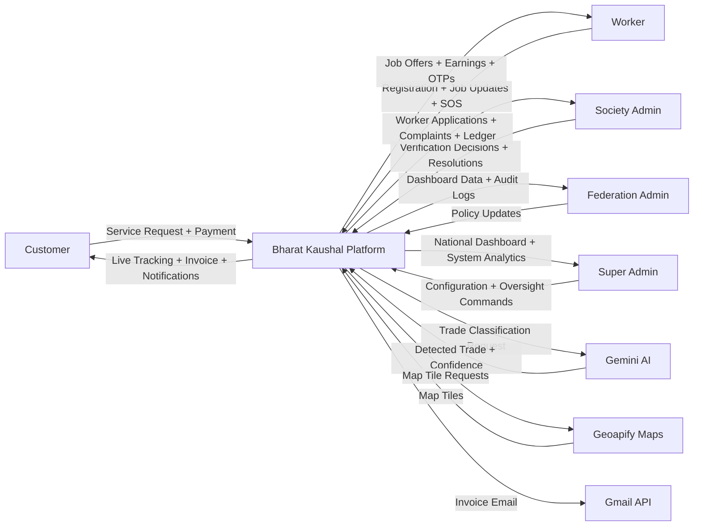
```mermaid
graph LR
    C["Customer"] -->|"Service Request + Payment"| SYS["Bharat Kaushal Platform"]
    SYS -->|"Live Tracking + Invoice + Notifications"| C
    
    W["Worker"] -->|"Registration + Job Updates + SOS"| SYS
    SYS -->|"Job Offers + Earnings + OTPs"| W
    
    SA["Society Admin"] -->|"Verification Decisions + Resolutions"| SYS
    SYS -->|"Worker Applications + Complaints + Ledger"| SA
    
    FA["Federation Admin"] -->|"Policy Updates"| SYS
    SYS -->|"Dashboard Data + Audit Logs"| FA
    
    GA["Super Admin"] -->|"Configuration + Oversight Commands"| SYS
    SYS -->|"National Dashboard + System Analytics"| GA
    
    SYS -->|"Trade Classification Request"| AI["Gemini AI"]
    AI -->|"Detected Trade + Confidence"| SYS
    
    SYS -->|"Map Tile Requests"| GEO["Geoapify Maps"]
    GEO -->|"Map Tiles"| SYS
    
    SYS -->|"Invoice Email"| GMAIL["Gmail API"]
```
</details>

## Level 1 (Detailed Processes)



<details>
<summary>▶ Click to inspect Mermaid source definition</summary>

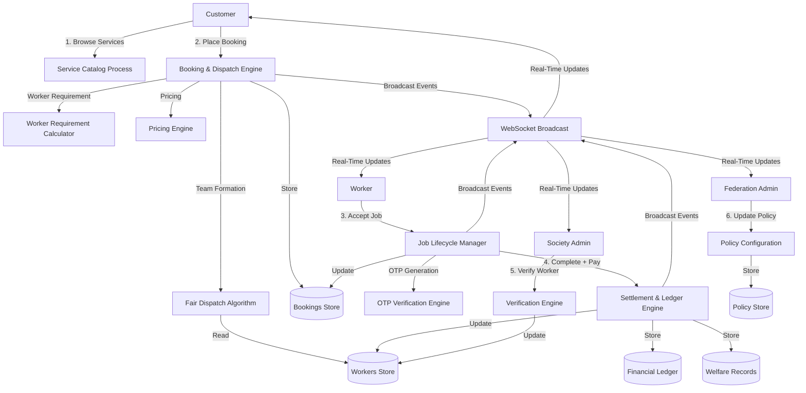
```mermaid
graph TD
    C["Customer"] -->|"1. Browse Services"| P1["Service Catalog Process"]
    C -->|"2. Place Booking"| P2["Booking & Dispatch Engine"]
    P2 -->|"Worker Requirement"| P3["Worker Requirement Calculator"]
    P2 -->|"Pricing"| P4["Pricing Engine"]
    P2 -->|"Team Formation"| P5["Fair Dispatch Algorithm"]
    
    P2 -->|"Store"| D1[("Bookings Store")]
    P5 -->|"Read"| D2[("Workers Store")]
    
    W["Worker"] -->|"3. Accept Job"| P6["Job Lifecycle Manager"]
    P6 -->|"OTP Generation"| P7["OTP Verification Engine"]
    P6 -->|"Update"| D1
    
    P6 -->|"4. Complete + Pay"| P8["Settlement & Ledger Engine"]
    P8 -->|"Store"| D3[("Financial Ledger")]
    P8 -->|"Store"| D4[("Welfare Records")]
    P8 -->|"Update"| D2
    
    SA["Society Admin"] -->|"5. Verify Worker"| P9["Verification Engine"]
    P9 -->|"Update"| D2
    
    FA["Federation Admin"] -->|"6. Update Policy"| P10["Policy Configuration"]
    P10 -->|"Store"| D5[("Policy Store")]
    
    P2 & P6 & P8 -->|"Broadcast Events"| WS["WebSocket Broadcast"]
    WS -->|"Real-Time Updates"| C & W & SA & FA
```
</details>

---

# 11. Entity Relationship Diagram (ERD)

> **In simple words**: This shows all the main "things" (entities) in the system and how they are related to each other.



<details>
<summary>▶ Click to inspect Mermaid source definition</summary>

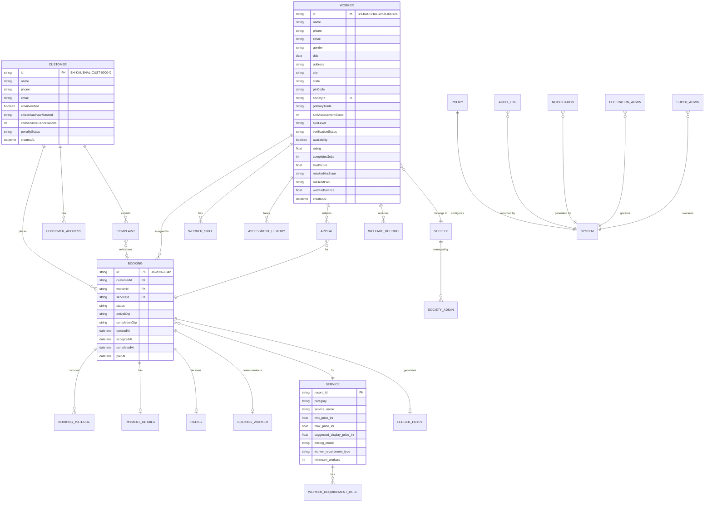
```mermaid
erDiagram
    CUSTOMER ||--o{ BOOKING : "places"
    CUSTOMER ||--o{ CUSTOMER_ADDRESS : "has"
    CUSTOMER ||--o{ COMPLAINT : "submits"
    
    WORKER ||--o{ BOOKING : "assigned to"
    WORKER ||--o{ WORKER_SKILL : "has"
    WORKER ||--o{ ASSESSMENT_HISTORY : "takes"
    WORKER ||--o{ APPEAL : "submits"
    WORKER ||--o{ WELFARE_RECORD : "receives"
    WORKER }o--|| SOCIETY : "belongs to"
    
    BOOKING ||--o{ BOOKING_MATERIAL : "includes"
    BOOKING ||--o| PAYMENT_DETAILS : "has"
    BOOKING ||--o| RATING : "receives"
    BOOKING ||--o| BOOKING_WORKER : "team members"
    BOOKING }o--|| SERVICE : "for"
    BOOKING ||--o| LEDGER_ENTRY : "generates"
    
    SERVICE ||--o{ WORKER_REQUIREMENT_RULE : "has"
    
    SOCIETY ||--o{ SOCIETY_ADMIN : "managed by"
    
    COMPLAINT }o--o| BOOKING : "references"
    APPEAL }o--|| BOOKING : "for"
    
    POLICY ||--|| SYSTEM : "configures"
    AUDIT_LOG }o--|| SYSTEM : "recorded by"
    NOTIFICATION }o--|| SYSTEM : "generated by"
    
    FEDERATION_ADMIN }o--|| SYSTEM : "governs"
    SUPER_ADMIN }o--|| SYSTEM : "oversees"

    CUSTOMER {
        string id PK "BH-KAUSHAL-CUST-000042"
        string name
        string phone
        string email
        boolean emailVerified
        string citizenAadhaarMasked
        int consecutiveCancellations
        string penaltyStatus
        datetime createdAt
    }
    
    WORKER {
        string id PK "BH-KAUSHAL-WKR-000124"
        string name
        string phone
        string email
        string gender
        date dob
        string address
        string city
        string state
        string pinCode
        string societyId FK
        string primaryTrade
        int skillAssessmentScore
        string skillLevel
        string verificationStatus
        boolean availability
        float rating
        int completedJobs
        float trustScore
        string maskedAadhaar
        string maskedPan
        float welfareBalance
        datetime createdAt
    }
    
    BOOKING {
        string id PK "BK-2026-1042"
        string customerId FK
        string workerId FK
        string serviceId FK
        string status
        string arrivalOtp
        string completionOtp
        datetime createdAt
        datetime acceptedAt
        datetime completedAt
        datetime paidAt
    }
    
    SERVICE {
        string record_id PK
        string category
        string service_name
        float min_price_inr
        float max_price_inr
        float suggested_display_price_inr
        string pricing_model
        string worker_requirement_type
        int minimum_workers
    }
```
</details>

---

# 12. Activity Diagrams

> **In simple words**: These show the step-by-step flow of key processes — like what happens when someone books a service.

## 12.1 Booking Lifecycle Activity Diagram



<details>
<summary>▶ Click to inspect Mermaid source definition</summary>

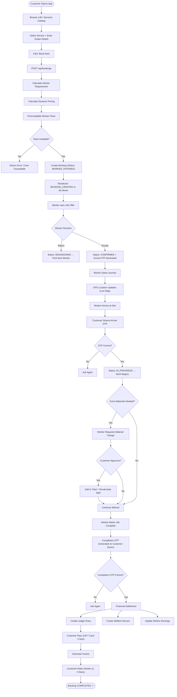
```mermaid
flowchart TD
    Start(["Customer Opens App"]) --> Browse["Browse 140+ Services Catalog"]
    Browse --> Select["Select Service + Enter Scope Details"]
    Select --> Book["Click 'Book Now'"]
    Book --> API["POST /api/bookings"]
    API --> CalcReq["Calculate Worker Requirement"]
    CalcReq --> CalcPrice["Calculate Dynamic Pricing"]
    CalcPrice --> FindTeam["Find Available Worker Team"]
    FindTeam --> TeamCheck{"Team Available?"}
    
    TeamCheck -->|No| Error["Return Error: Crew Unavailable"]
    TeamCheck -->|Yes| CreateBooking["Create Booking (Status: WORKER_OFFERED)"]
    CreateBooking --> Broadcast1["Broadcast BOOKING_CREATED to all clients"]
    
    Broadcast1 --> WorkerSees["Worker sees Job Offer"]
    WorkerSees --> AcceptReject{"Worker Decision"}
    
    AcceptReject -->|Reject| Reassign["Status: REASSIGNING → Find Next Worker"]
    AcceptReject -->|Accept| Confirmed["Status: CONFIRMED + Arrival OTP Generated"]
    
    Confirmed --> StartJourney["Worker Starts Journey"]
    StartJourney --> LiveTracking["GPS Location Updates (Live Map)"]
    LiveTracking --> Arrived["Worker Arrives at Site"]
    
    Arrived --> ArrivalOTP["Customer Shares Arrival OTP"]
    ArrivalOTP --> VerifyOTP1{"OTP Correct?"}
    VerifyOTP1 -->|No| RetryOTP1["Ask Again"]
    VerifyOTP1 -->|Yes| InProgress["Status: IN_PROGRESS → Work Begins"]
    
    InProgress --> MaterialCheck{"Extra Materials Needed?"}
    MaterialCheck -->|Yes| RequestMaterial["Worker Requests Material Charge"]
    RequestMaterial --> CustomerApprove{"Customer Approves?"}
    CustomerApprove -->|Yes| AddCharge["Add to Total + Recalculate Split"]
    CustomerApprove -->|No| ContinueWork["Continue Without"]
    MaterialCheck -->|No| ContinueWork
    AddCharge --> ContinueWork
    
    ContinueWork --> JobDone["Worker Marks Job Complete"]
    JobDone --> CompletionOTP["Completion OTP Generated on Customer Device"]
    CompletionOTP --> VerifyOTP2{"Completion OTP Correct?"}
    VerifyOTP2 -->|No| RetryOTP2["Ask Again"]
    VerifyOTP2 -->|Yes| Settlement["Financial Settlement"]
    
    Settlement --> LedgerEntry["Create Ledger Entry"]
    Settlement --> WelfareEntry["Create Welfare Record"]
    Settlement --> UpdateEarnings["Update Worker Earnings"]
    
    LedgerEntry --> Payment["Customer Pays (UPI / Card / Cash)"]
    Payment --> Invoice["Generate Invoice"]
    Invoice --> Rate["Customer Rates Worker (1-5 Stars)"]
    Rate --> Complete(["Booking COMPLETED ✅"])
```
</details>

## 12.2 Worker Registration Activity Diagram



<details>
<summary>▶ Click to inspect Mermaid source definition</summary>

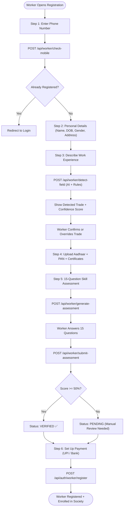
```mermaid
flowchart TD
    Start(["Worker Opens Registration"]) --> Step1["Step 1: Enter Phone Number"]
    Step1 --> CheckMobile["POST /api/worker/check-mobile"]
    CheckMobile --> Exists{"Already Registered?"}
    Exists -->|Yes| Login["Redirect to Login"]
    Exists -->|No| Step2["Step 2: Personal Details (Name, DOB, Gender, Address)"]
    Step2 --> Step3["Step 3: Describe Work Experience"]
    Step3 --> DetectField["POST /api/worker/detect-field (AI + Rules)"]
    DetectField --> ShowTrade["Show Detected Trade + Confidence Score"]
    ShowTrade --> ConfirmTrade["Worker Confirms or Overrides Trade"]
    ConfirmTrade --> Step4["Step 4: Upload Aadhaar + PAN + Certificates"]
    Step4 --> Step5["Step 5: 15-Question Skill Assessment"]
    Step5 --> GenQuestions["POST /api/worker/generate-assessment"]
    GenQuestions --> TakeTest["Worker Answers 15 Questions"]
    TakeTest --> Submit["POST /api/worker/submit-assessment"]
    Submit --> ScoreCheck{"Score >= 50%?"}
    ScoreCheck -->|Yes| Verified["Status: VERIFIED ✅"]
    ScoreCheck -->|No| Pending["Status: PENDING (Manual Review Needed)"]
    Verified --> Step6["Step 6: Set Up Payment (UPI / Bank)"]
    Pending --> Step6
    Step6 --> Register["POST /api/auth/worker/register"]
    Register --> Complete(["Worker Registered + Enrolled in Society"])
```
</details>

---

# 13. Database Diagram (SQL Design)

> **In simple words**: Currently, the project stores everything in JavaScript arrays in server memory (no database). Below is a proposed SQL database design if you were to connect a real SQL database (like MySQL or PostgreSQL).



<details>
<summary>▶ Click to inspect Mermaid source definition</summary>


```mermaid
erDiagram
    customers {
        VARCHAR(30) id PK "BH-KAUSHAL-CUST-000042"
        VARCHAR(100) name
        VARCHAR(15) phone
        VARCHAR(100) email
        BOOLEAN email_verified
        TIMESTAMP email_verified_at
        VARCHAR(200) photo_url
        VARCHAR(20) citizen_aadhaar_masked
        INT consecutive_cancellations
        ENUM penalty_status "NONE, PENALTY_50_INR"
        TIMESTAMP created_at
    }
    
    customer_addresses {
        VARCHAR(30) id PK
        VARCHAR(30) customer_id FK
        ENUM label "Home, Office, Other"
        TEXT address
        VARCHAR(100) line1
        VARCHAR(100) locality
        VARCHAR(100) landmark
        DECIMAL lat
        DECIMAL lng
        VARCHAR(50) city
        VARCHAR(50) state
        VARCHAR(10) pin_code
    }
    
    workers {
        VARCHAR(30) id PK "BH-KAUSHAL-WKR-000124"
        VARCHAR(100) name
        VARCHAR(15) phone
        VARCHAR(15) alternate_phone
        VARCHAR(100) email
        BOOLEAN email_verified
        VARCHAR(200) photo_url
        ENUM gender "Male, Female, Other"
        DATE dob
        TEXT address
        VARCHAR(50) city
        VARCHAR(50) district
        VARCHAR(50) state
        VARCHAR(10) pin_code
        VARCHAR(20) society_id FK
        VARCHAR(50) primary_trade
        INT skill_assessment_score
        ENUM skill_level "Basic, Intermediate, Advanced, Expert"
        ENUM verification_status "PENDING, UNDER_REVIEW, VERIFIED, REJECTED"
        VARCHAR(200) rejection_reason
        BOOLEAN availability
        DECIMAL rating
        INT total_ratings_count
        INT completed_jobs
        INT failed_jobs
        INT consecutive_failures
        ENUM penalty_status "NONE, WARNING, PENALTY_30_PERCENT"
        DECIMAL earnings_today
        DECIMAL earnings_week
        DECIMAL earnings_month
        DECIMAL earnings_total
        INT trust_score
        INT reliability_score
        DECIMAL current_lat
        DECIMAL current_lng
        VARCHAR(20) masked_aadhaar
        VARCHAR(15) masked_pan
        DECIMAL welfare_balance
        VARCHAR(20) uan_number
        VARCHAR(50) upi_id
        VARCHAR(30) bank_account
        VARCHAR(15) ifsc
        ENUM preferred_language "en, hi, mr, gu, bn, ta, te, kn, ml, pa, or, as"
        TIMESTAMP created_at
    }
    
    worker_skills {
        INT id PK
        VARCHAR(30) worker_id FK
        VARCHAR(100) skill_name
        BOOLEAN is_primary
        INT years_experience
        TEXT description
    }
    
    assessment_history {
        INT id PK
        VARCHAR(30) worker_id FK
        TIMESTAMP assessment_date
        INT score
        INT total_questions
        INT percentage
        VARCHAR(20) level
        VARCHAR(50) trade
        JSON category_breakdown
    }
    
    worker_documents {
        INT id PK
        VARCHAR(30) worker_id FK
        BOOLEAN aadhaar_uploaded
        BOOLEAN pan_uploaded
        BOOLEAN license_uploaded
        BOOLEAN cert_uploaded
        VARCHAR(300) aadhaar_doc_url
    }
    
    trust_score_breakdown {
        INT id PK
        VARCHAR(30) worker_id FK
        INT identity_score
        INT society_score
        INT skill_score
        INT experience_score
        INT performance_score
        INT rating_score
        INT reliability_score
        INT total
        JSON notes
    }
    
    societies {
        VARCHAR(20) id PK "SOC-IND-02"
        VARCHAR(200) name
        VARCHAR(50) code
        VARCHAR(50) city
        VARCHAR(50) district
        VARCHAR(50) state
        VARCHAR(50) federation_id FK
    }
    
    society_admins {
        VARCHAR(20) id PK "ADM-IND-02-77"
        VARCHAR(100) name
        VARCHAR(15) phone
        VARCHAR(100) email
        BOOLEAN email_verified
        VARCHAR(20) society_id FK
        VARCHAR(100) designation
        VARCHAR(50) dsc_certificate_serial
        VARCHAR(100) registered_jurisdiction
        TIMESTAMP created_at
    }
    
    federation_admins {
        VARCHAR(20) id PK "FED-DIR-MP-001"
        VARCHAR(100) name
        VARCHAR(15) phone
        VARCHAR(100) email
        BOOLEAN email_verified
        VARCHAR(100) department
        ENUM clearance_level "LEVEL_2_IMC_COMMAND, LEVEL_3_DIRECTOR, LEVEL_4_EXECUTIVE"
        VARCHAR(100) official_designation
        VARCHAR(100) station
        TIMESTAMP created_at
    }
    
    super_admins {
        VARCHAR(20) id PK "GOV-MOL-JS-001"
        VARCHAR(100) name
        VARCHAR(15) phone
        VARCHAR(100) email
        BOOLEAN email_verified
        VARCHAR(100) ministry
        VARCHAR(100) department
        VARCHAR(100) official_designation
        VARCHAR(50) cadre
        ENUM clearance_level "LEVEL_3_REGULATORY, LEVEL_4_MINISTERIAL, APEX_LEVEL_5_NATIONAL"
        ENUM mfa_method "AADHAAR_TOTP, HARDWARE_KEY, OFFICIAL_OTP"
        TIMESTAMP token_expires_at
        TIMESTAMP created_at
    }
    
    services {
        VARCHAR(20) record_id PK
        VARCHAR(50) city
        VARCHAR(50) state
        VARCHAR(10) currency
        VARCHAR(50) category
        VARCHAR(200) service_name
        VARCHAR(50) pricing_unit
        DECIMAL min_price_inr
        DECIMAL max_price_inr
        DECIMAL suggested_display_price_inr
        VARCHAR(20) price_type
        TEXT materials_or_parts_included
        TEXT notes
        DECIMAL estimated_duration_hours
        ENUM worker_requirement_type "SINGLE_WORKER, MULTI_WORKER_CONDITIONAL, MULTI_WORKER_COMPULSORY"
        ENUM pricing_model "PER_JOB, PER_WORKER, PER_DAY_PER_WORKER, PER_UNIT, PER_SQFT"
        INT minimum_workers
        INT recommended_workers
        JSON team_roles
        JSON worker_requirement_rules
    }
    
    bookings {
        VARCHAR(20) id PK "BK-2026-1042"
        VARCHAR(30) customer_id FK
        VARCHAR(30) worker_id FK
        VARCHAR(20) service_id FK
        VARCHAR(30) customer_address_id FK
        ENUM status "DRAFT, REQUESTED, MATCHING, WORKER_OFFERED, ACCEPTED, CONFIRMED, TRAVELLING, ARRIVED, IN_PROGRESS, COMPLETION_PENDING, PAYMENT_PENDING, COMPLETED, CANCELLED"
        DECIMAL base_labour
        DECIMAL travel_charge
        DECIMAL urgency_charge
        DECIMAL materials_total
        DECIMAL tax
        DECIMAL discount
        DECIMAL gross_amount
        DECIMAL worker_share
        DECIMAL society_share
        DECIMAL welfare_share
        DECIMAL net_payable
        VARCHAR(10) arrival_otp
        VARCHAR(10) completion_otp
        DECIMAL worker_lat
        DECIMAL worker_lng
        DECIMAL distance_km
        INT eta_minutes
        DECIMAL search_radius_km
        JSON dispatch_log
        VARCHAR(200) cancellation_reason
        DECIMAL cancellation_penalty
        ENUM cancelled_by "WORKER, CUSTOMER, SYSTEM"
        BOOLEAN team_required
        INT team_size
        ENUM worker_requirement_type "SINGLE_WORKER, MULTI_WORKER_CONDITIONAL, MULTI_WORKER_COMPULSORY"
        JSON scope_details
        TIMESTAMP created_at
        TIMESTAMP accepted_at
        TIMESTAMP started_at
        TIMESTAMP completed_at
        TIMESTAMP paid_at
    }
    
    booking_materials {
        VARCHAR(20) id PK
        VARCHAR(20) booking_id FK
        VARCHAR(100) name
        DECIMAL amount
        ENUM status "PENDING, APPROVED, REJECTED"
        TIMESTAMP requested_at
    }
    
    booking_team_members {
        INT id PK
        VARCHAR(20) booking_id FK
        VARCHAR(30) worker_id FK
        VARCHAR(100) role
        BOOLEAN is_lead
        ENUM status "ASSIGNED, ACCEPTED, TRAVELLING, ARRIVED, REJECTED"
        TIMESTAMP assigned_at
        TIMESTAMP accepted_at
    }
    
    payment_details {
        VARCHAR(30) transaction_id PK
        VARCHAR(20) booking_id FK
        VARCHAR(30) utr_number
        ENUM method "UPI, CREDIT_CARD, DEBIT_CARD, CASH"
        VARCHAR(50) method_label
        DECIMAL paid_amount
        TIMESTAMP paid_at
        TIMESTAMP reconciled_at
        VARCHAR(30) invoice_number
        DECIMAL cash_tendered
        DECIMAL cash_change_returned
        ENUM reconciliation_status "PENDING, RECONCILED"
        VARCHAR(4) digital_card_last4
        VARCHAR(20) card_brand
        VARCHAR(50) upi_vpa
        TEXT notes
    }
    
    ratings {
        INT id PK
        VARCHAR(20) booking_id FK
        INT stars
        INT quality
        INT punctuality
        INT behaviour
        TEXT feedback
        TIMESTAMP created_at
    }
    
    financial_ledger {
        VARCHAR(30) id PK
        VARCHAR(20) booking_id FK
        DECIMAL customer_paid
        DECIMAL worker_credit
        DECIMAL society_credit
        DECIMAL welfare_credit
        VARCHAR(100) policy_snapshot
        ENUM status "PENDING, CAPTURED, SETTLED, RECONCILED"
        TIMESTAMP created_at
    }
    
    welfare_records {
        VARCHAR(30) id PK
        VARCHAR(30) worker_id FK
        VARCHAR(20) booking_id FK
        DECIMAL contribution_amount
        VARCHAR(200) scheme
        TIMESTAMP created_at
    }
    
    complaints {
        VARCHAR(30) id PK "CMP-2026-001245"
        VARCHAR(20) booking_id FK
        ENUM user_type "CUSTOMER, WORKER"
        VARCHAR(30) user_id FK
        VARCHAR(100) category
        TEXT description
        ENUM priority "LOW, MEDIUM, HIGH, EMERGENCY"
        ENUM status "SUBMITTED, UNDER_REVIEW, ASSIGNED, RESOLVED, CLOSED"
        VARCHAR(100) assigned_authority
        TEXT admin_response
        TIMESTAMP created_at
        TIMESTAMP updated_at
    }
    
    appeals {
        VARCHAR(30) id PK
        VARCHAR(30) worker_id FK
        VARCHAR(20) booking_id FK
        DECIMAL penalty_amount
        TEXT reason
        ENUM category "MEDICAL, VEHICLE_BREAKDOWN, SEVERE_WEATHER, UNSAFE_SITE, OTHER"
        ENUM status "PENDING, APPROVED, REJECTED"
        TEXT admin_remarks
        TIMESTAMP submitted_at
        TIMESTAMP reviewed_at
    }
    
    cooperative_policy {
        INT id PK
        ENUM active_model "MODEL_A, MODEL_B"
        DECIMAL model_a_worker_percent
        DECIMAL model_a_society_percent
        DECIMAL model_a_welfare_percent
        DECIMAL model_b_worker_percent
        DECIMAL model_b_maintenance_percent
        DECIMAL model_b_welfare_percent
        INT grace_window_minutes
        DECIMAL unexcused_penalty_inr
        DECIMAL three_strike_deduction_percent
        DECIMAL customer_cancel_fee_inr
        DECIMAL standard_radius_km
        DECIMAL emergency_radius_km
        DECIMAL max_radius_km
    }
    
    audit_logs {
        VARCHAR(30) id PK
        VARCHAR(50) event
        VARCHAR(50) user_id
        TEXT details
        TIMESTAMP created_at
    }
    
    notifications {
        VARCHAR(30) id PK
        VARCHAR(200) title
        TEXT body
        ENUM type "INFO, SUCCESS, WARNING, ALERT"
        ENUM target_role "CUSTOMER, WORKER, SOCIETY_ADMIN, FEDERATION_ADMIN, SUPER_ADMIN, ALL"
        VARCHAR(30) target_user_id
        VARCHAR(20) booking_id
        BOOLEAN is_read
        TIMESTAMP created_at
    }
    
    email_otp_store {
        VARCHAR(100) email PK
        VARCHAR(6) otp
        VARCHAR(20) role
        VARCHAR(30) entity_id
        VARCHAR(100) entity_name
        TIMESTAMP expires_at
        TIMESTAMP created_at
    }
    
    customers ||--o{ customer_addresses : "has"
    customers ||--o{ bookings : "places"
    customers ||--o{ complaints : "submits"
    workers ||--o{ worker_skills : "has"
    workers ||--o{ assessment_history : "takes"
    workers ||--|| worker_documents : "has"
    workers ||--|| trust_score_breakdown : "has"
    workers ||--o{ bookings : "assigned to"
    workers ||--o{ appeals : "submits"
    workers ||--o{ welfare_records : "receives"
    workers }o--|| societies : "belongs to"
    societies ||--o{ society_admins : "managed by"
    bookings ||--o{ booking_materials : "includes"
    bookings ||--o{ booking_team_members : "has"
    bookings ||--o| payment_details : "has"
    bookings ||--o| ratings : "receives"
    bookings ||--o| financial_ledger : "generates"
    bookings }o--|| services : "for"
    complaints }o--o| bookings : "references"
    appeals }o--|| bookings : "for"
```
</details>

### Total Tables: 20

| # | Table Name | Purpose |
|---|-----------|---------|
| 1 | `customers` | Customer profiles |
| 2 | `customer_addresses` | Multiple addresses per customer |
| 3 | `workers` | Worker/craftsman profiles |
| 4 | `worker_skills` | Skills with experience years |
| 5 | `worker_documents` | Document upload status |
| 6 | `trust_score_breakdown` | 7-dimension trust scoring |
| 7 | `assessment_history` | Skill test results |
| 8 | `societies` | Cooperative societies |
| 9 | `society_admins` | Society admin users |
| 10 | `federation_admins` | Federation command officers |
| 11 | `super_admins` | Government oversight officials |
| 12 | `services` | 140+ service catalog |
| 13 | `bookings` | Core booking records |
| 14 | `booking_materials` | Extra material charges |
| 15 | `booking_team_members` | Multi-worker team assignments |
| 16 | `payment_details` | Payment transactions |
| 17 | `ratings` | Customer ratings |
| 18 | `financial_ledger` | Revenue split records |
| 19 | `welfare_records` | Worker welfare fund contributions |
| 20 | `complaints` | Support tickets |
| 21 | `appeals` | Worker penalty appeals |
| 22 | `cooperative_policy` | Revenue split policy config |
| 23 | `audit_logs` | System event audit trail |
| 24 | `notifications` | User notifications |
| 25 | `email_otp_store` | Temporary email OTP storage |

---

# 14. Sequence Diagrams

> **In simple words**: These show the exact order of messages between different parts of the system when something happens.

## 14.1 Complete Booking Lifecycle Sequence

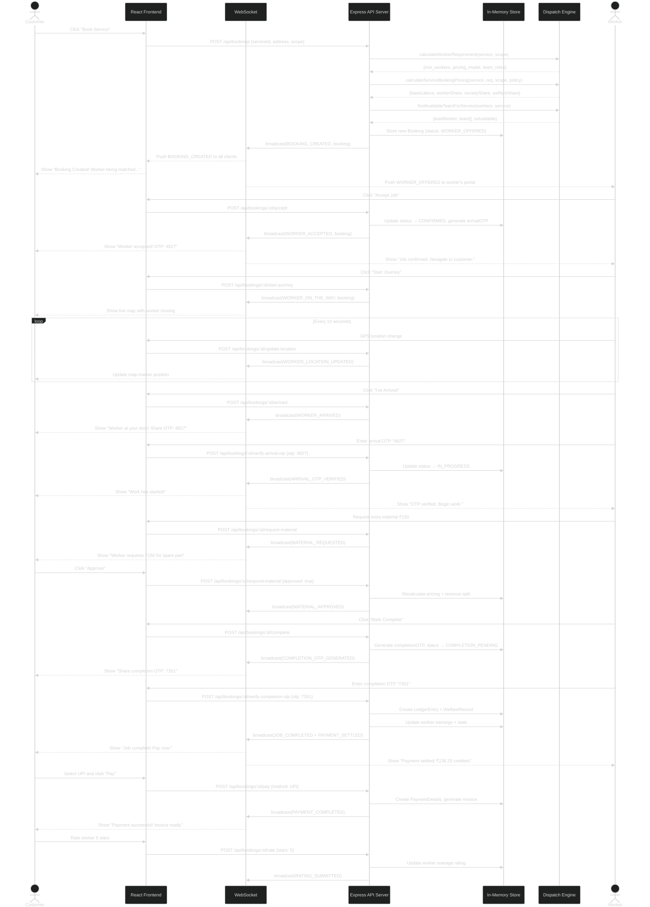

<details>
<summary>▶ Click to inspect Mermaid source definition</summary>

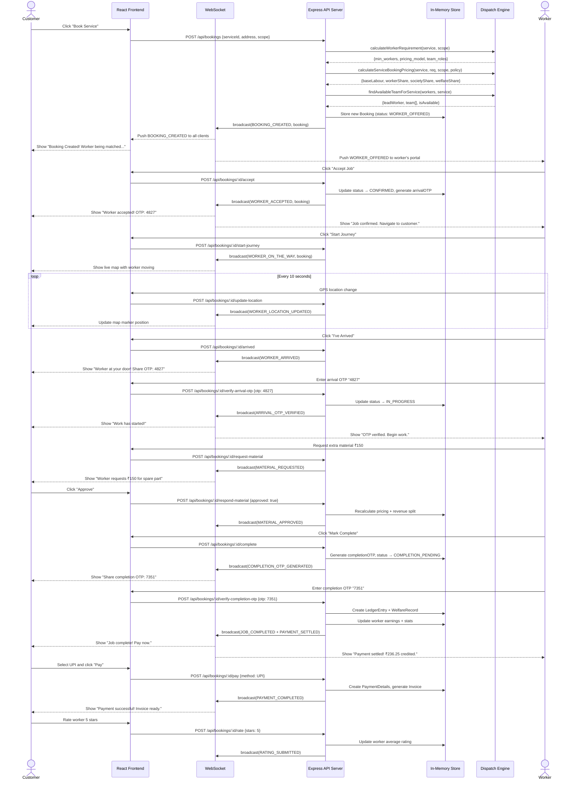
```mermaid
sequenceDiagram
    actor C as Customer
    participant FE as React Frontend
    participant WS as WebSocket
    participant API as Express API Server
    participant DB as In-Memory Store
    participant Engine as Dispatch Engine
    actor W as Worker

    C->>FE: Click "Book Service"
    FE->>API: POST /api/bookings {serviceId, address, scope}
    API->>Engine: calculateWorkerRequirement(service, scope)
    Engine-->>API: {min_workers, pricing_model, team_roles}
    API->>Engine: calculateServiceBookingPricing(service, req, scope, policy)
    Engine-->>API: {baseLabour, workerShare, societyShare, welfareShare}
    API->>Engine: findAvailableTeamForService(workers, service)
    Engine-->>API: {leadWorker, team[], isAvailable}
    API->>DB: Store new Booking (status: WORKER_OFFERED)
    API->>WS: broadcast(BOOKING_CREATED, booking)
    WS-->>FE: Push BOOKING_CREATED to all clients
    FE-->>C: Show "Booking Created! Worker being matched..."
    WS-->>W: Push WORKER_OFFERED to worker's portal

    W->>FE: Click "Accept Job"
    FE->>API: POST /api/bookings/:id/accept
    API->>DB: Update status → CONFIRMED, generate arrivalOTP
    API->>WS: broadcast(WORKER_ACCEPTED, booking)
    WS-->>C: Show "Worker accepted! OTP: 4827"
    WS-->>W: Show "Job confirmed. Navigate to customer."

    W->>FE: Click "Start Journey"
    FE->>API: POST /api/bookings/:id/start-journey
    API->>WS: broadcast(WORKER_ON_THE_WAY, booking)
    WS-->>C: Show live map with worker moving

    loop Every 10 seconds
        W->>FE: GPS location change
        FE->>API: POST /api/bookings/:id/update-location
        API->>WS: broadcast(WORKER_LOCATION_UPDATED)
        WS-->>C: Update map marker position
    end

    W->>FE: Click "I've Arrived"
    FE->>API: POST /api/bookings/:id/arrived
    API->>WS: broadcast(WORKER_ARRIVED)
    WS-->>C: Show "Worker at your door! Share OTP: 4827"

    W->>FE: Enter arrival OTP "4827"
    FE->>API: POST /api/bookings/:id/verify-arrival-otp {otp: 4827}
    API->>DB: Update status → IN_PROGRESS
    API->>WS: broadcast(ARRIVAL_OTP_VERIFIED)
    WS-->>C: Show "Work has started!"
    WS-->>W: Show "OTP verified. Begin work."

    W->>FE: Request extra material ₹150
    FE->>API: POST /api/bookings/:id/request-material
    API->>WS: broadcast(MATERIAL_REQUESTED)
    WS-->>C: Show "Worker requests ₹150 for spare part"
    C->>FE: Click "Approve"
    FE->>API: POST /api/bookings/:id/respond-material {approved: true}
    API->>DB: Recalculate pricing + revenue split
    API->>WS: broadcast(MATERIAL_APPROVED)

    W->>FE: Click "Mark Complete"
    FE->>API: POST /api/bookings/:id/complete
    API->>DB: Generate completionOTP, status → COMPLETION_PENDING
    API->>WS: broadcast(COMPLETION_OTP_GENERATED)
    WS-->>C: Show "Share completion OTP: 7351"

    W->>FE: Enter completion OTP "7351"
    FE->>API: POST /api/bookings/:id/verify-completion-otp {otp: 7351}
    API->>DB: Create LedgerEntry + WelfareRecord
    API->>DB: Update worker earnings + stats
    API->>WS: broadcast(JOB_COMPLETED + PAYMENT_SETTLED)
    WS-->>C: Show "Job complete! Pay now."
    WS-->>W: Show "Payment settled! ₹236.25 credited."

    C->>FE: Select UPI and click "Pay"
    FE->>API: POST /api/bookings/:id/pay {method: UPI}
    API->>DB: Create PaymentDetails, generate Invoice
    API->>WS: broadcast(PAYMENT_COMPLETED)
    WS-->>C: Show "Payment successful! Invoice ready."

    C->>FE: Rate worker 5 stars
    FE->>API: POST /api/bookings/:id/rate {stars: 5}
    API->>DB: Update worker average rating
    API->>WS: broadcast(RATING_SUBMITTED)
```
</details>

## 14.2 Worker Registration Sequence

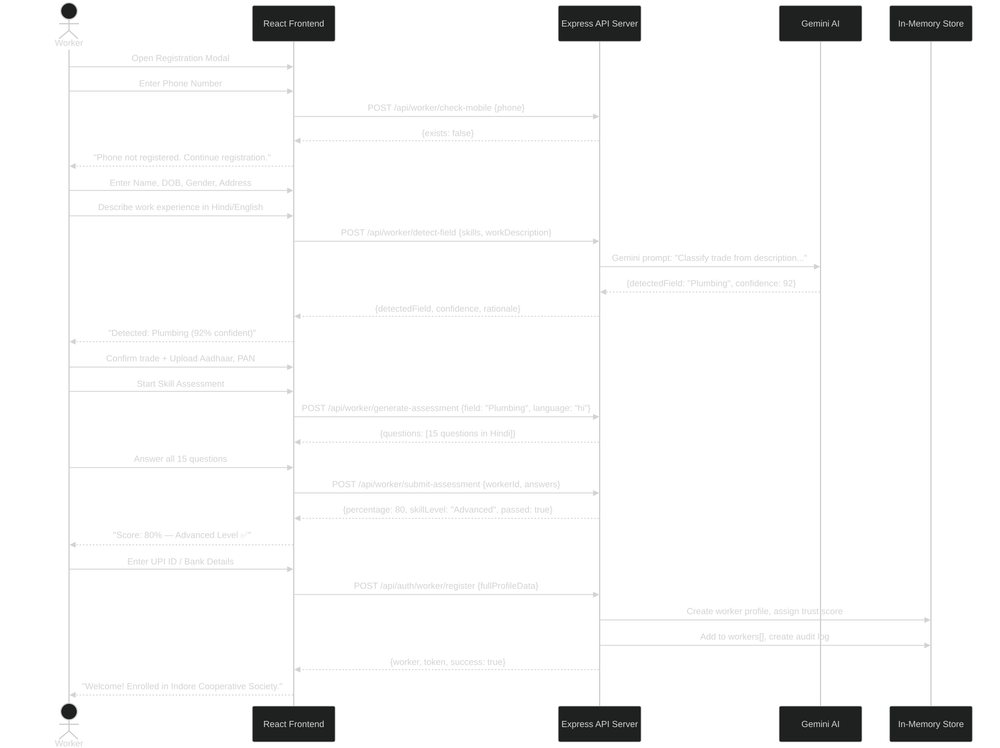

<details>
<summary>▶ Click to inspect Mermaid source definition</summary>

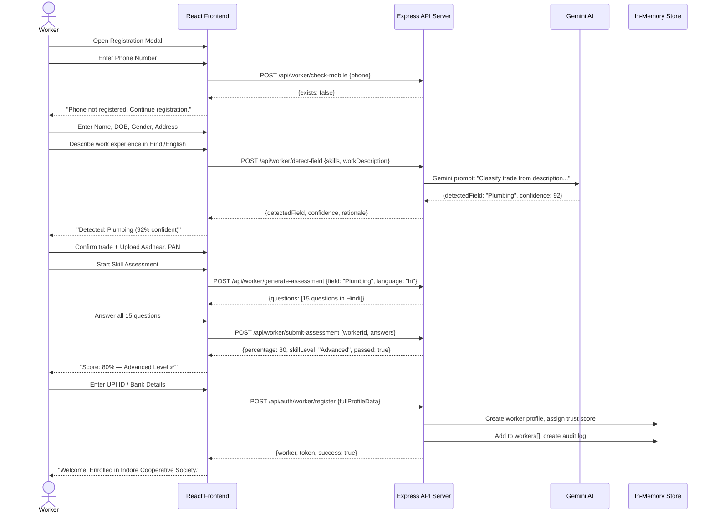
```mermaid
sequenceDiagram
    actor W as Worker
    participant FE as React Frontend
    participant API as Express API Server
    participant AI as Gemini AI
    participant DB as In-Memory Store

    W->>FE: Open Registration Modal
    W->>FE: Enter Phone Number
    FE->>API: POST /api/worker/check-mobile {phone}
    API-->>FE: {exists: false}
    FE-->>W: "Phone not registered. Continue registration."
    
    W->>FE: Enter Name, DOB, Gender, Address
    W->>FE: Describe work experience in Hindi/English
    FE->>API: POST /api/worker/detect-field {skills, workDescription}
    API->>AI: Gemini prompt: "Classify trade from description..."
    AI-->>API: {detectedField: "Plumbing", confidence: 92}
    API-->>FE: {detectedField, confidence, rationale}
    FE-->>W: "Detected: Plumbing (92% confident)"
    
    W->>FE: Confirm trade + Upload Aadhaar, PAN
    
    W->>FE: Start Skill Assessment
    FE->>API: POST /api/worker/generate-assessment {field: "Plumbing", language: "hi"}
    API-->>FE: {questions: [15 questions in Hindi]}
    
    W->>FE: Answer all 15 questions
    FE->>API: POST /api/worker/submit-assessment {workerId, answers}
    API-->>FE: {percentage: 80, skillLevel: "Advanced", passed: true}
    FE-->>W: "Score: 80% — Advanced Level ✅"
    
    W->>FE: Enter UPI ID / Bank Details
    FE->>API: POST /api/auth/worker/register {fullProfileData}
    API->>DB: Create worker profile, assign trust score
    API->>DB: Add to workers[], create audit log
    API-->>FE: {worker, token, success: true}
    FE-->>W: "Welcome! Enrolled in Indore Cooperative Society."
```
</details>

## 14.3 Authentication Sequence (Customer Login)

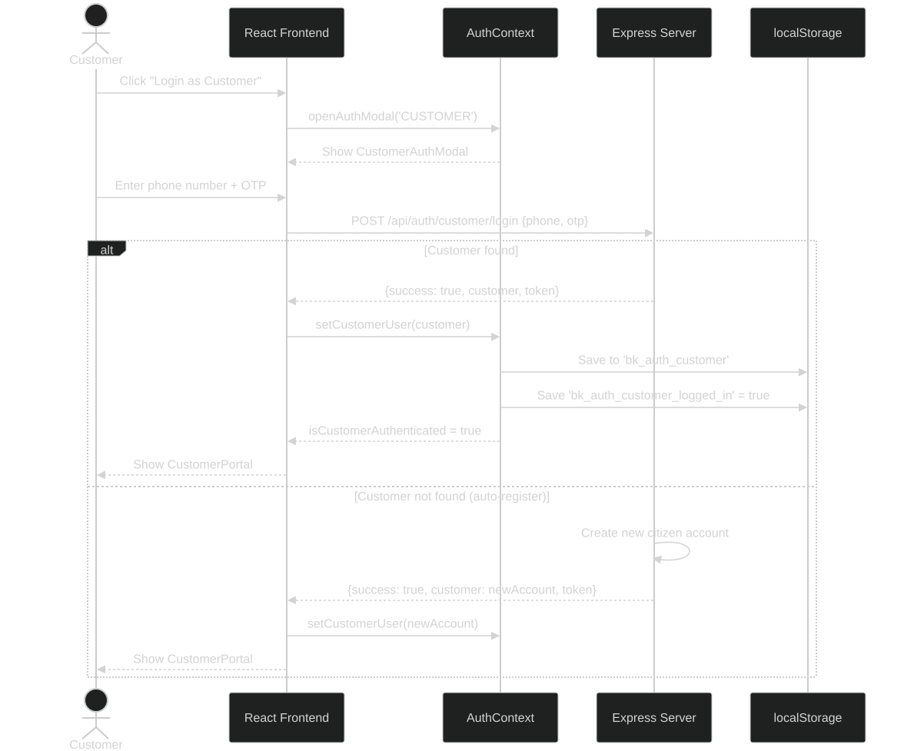

<details>
<summary>▶ Click to inspect Mermaid source definition</summary>

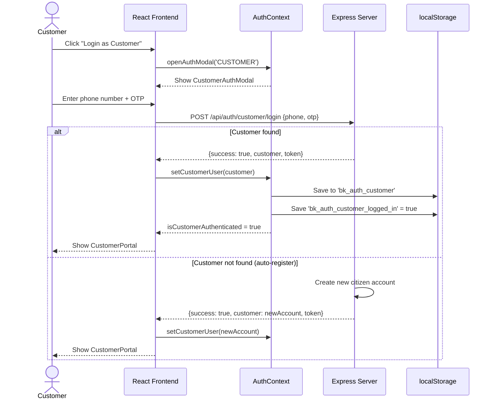
```mermaid
sequenceDiagram
    actor C as Customer
    participant FE as React Frontend
    participant AC as AuthContext
    participant API as Express Server
    participant LS as localStorage

    C->>FE: Click "Login as Customer"
    FE->>AC: openAuthModal('CUSTOMER')
    AC-->>FE: Show CustomerAuthModal
    C->>FE: Enter phone number + OTP
    FE->>API: POST /api/auth/customer/login {phone, otp}
    
    alt Customer found
        API-->>FE: {success: true, customer, token}
        FE->>AC: setCustomerUser(customer)
        AC->>LS: Save to 'bk_auth_customer'
        AC->>LS: Save 'bk_auth_customer_logged_in' = true
        AC-->>FE: isCustomerAuthenticated = true
        FE-->>C: Show CustomerPortal
    else Customer not found (auto-register)
        API->>API: Create new citizen account
        API-->>FE: {success: true, customer: newAccount, token}
        FE->>AC: setCustomerUser(newAccount)
        FE-->>C: Show CustomerPortal
    end
```
</details>

## 14.4 Cancellation & Penalty Appeal Sequence

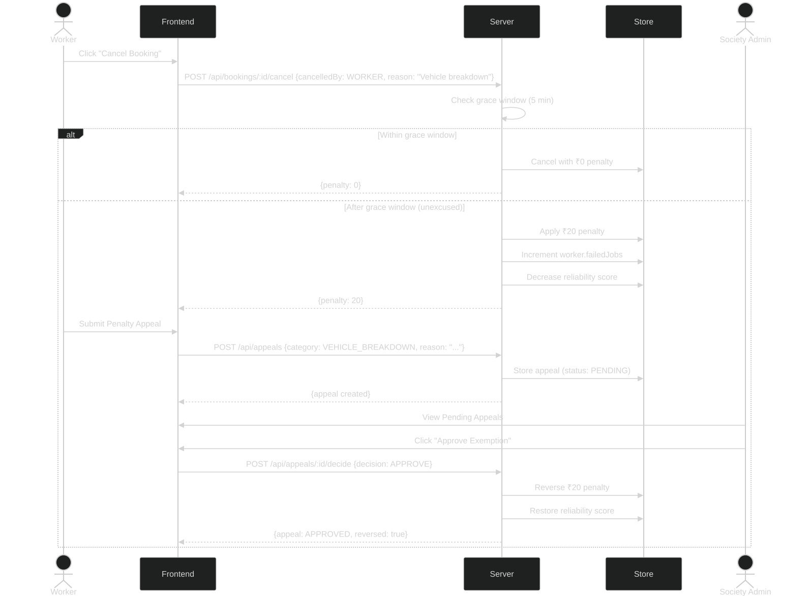

<details>
<summary>▶ Click to inspect Mermaid source definition</summary>

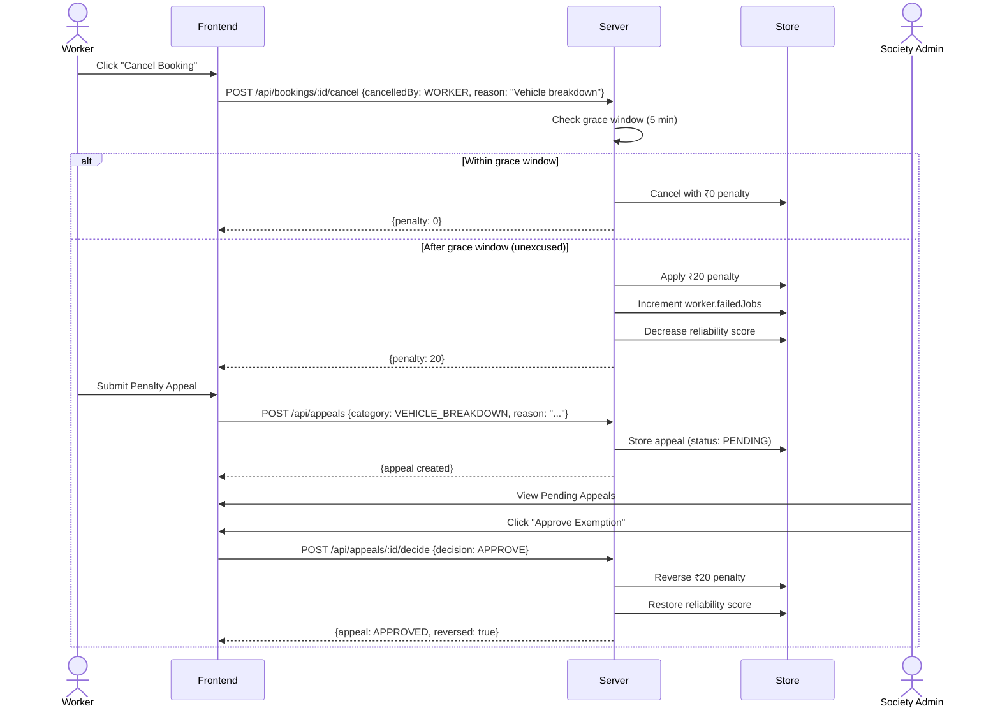
```mermaid
sequenceDiagram
    actor W as Worker
    participant FE as Frontend
    participant API as Server
    participant DB as Store
    actor SA as Society Admin

    W->>FE: Click "Cancel Booking"
    FE->>API: POST /api/bookings/:id/cancel {cancelledBy: WORKER, reason: "Vehicle breakdown"}
    
    API->>API: Check grace window (5 min)
    
    alt Within grace window
        API->>DB: Cancel with ₹0 penalty
        API-->>FE: {penalty: 0}
    else After grace window (unexcused)
        API->>DB: Apply ₹20 penalty
        API->>DB: Increment worker.failedJobs
        API->>DB: Decrease reliability score
        API-->>FE: {penalty: 20}
        
        W->>FE: Submit Penalty Appeal
        FE->>API: POST /api/appeals {category: VEHICLE_BREAKDOWN, reason: "..."}
        API->>DB: Store appeal (status: PENDING)
        API-->>FE: {appeal created}
        
        SA->>FE: View Pending Appeals
        SA->>FE: Click "Approve Exemption"
        FE->>API: POST /api/appeals/:id/decide {decision: APPROVE}
        API->>DB: Reverse ₹20 penalty
        API->>DB: Restore reliability score
        API-->>FE: {appeal: APPROVED, reversed: true}
    end
```
</details>

## 14.5 Real-Time WebSocket Connection Sequence

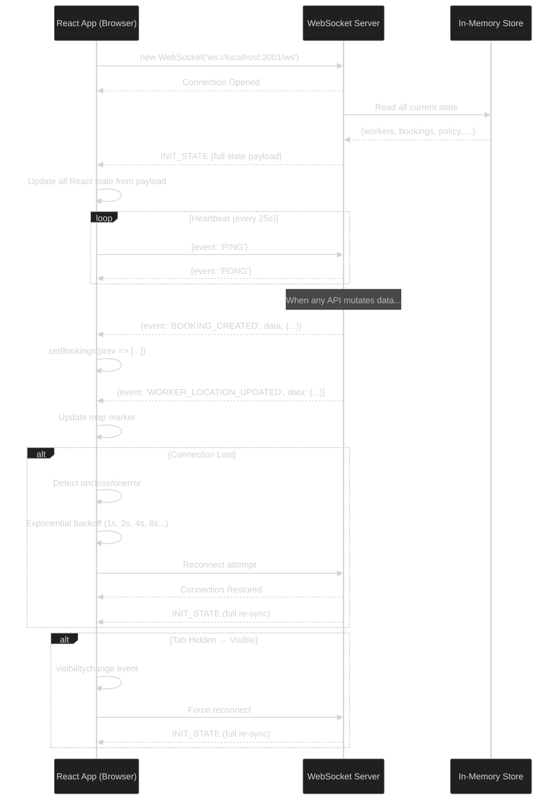

<details>
<summary>▶ Click to inspect Mermaid source definition</summary>

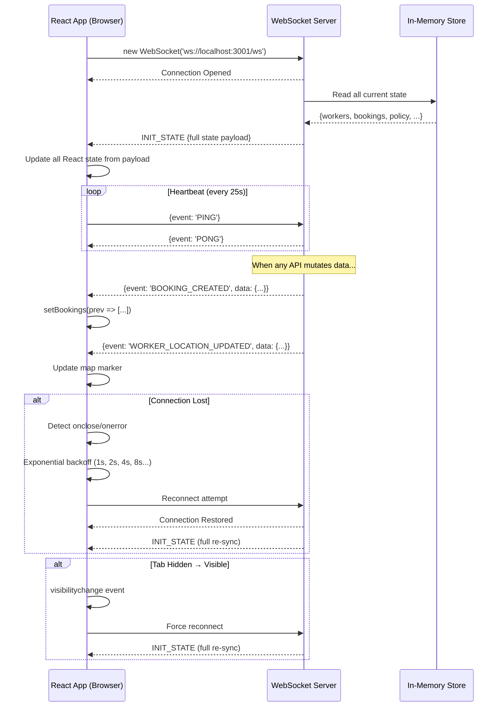
```mermaid
sequenceDiagram
    participant Browser as React App (Browser)
    participant WS as WebSocket Server
    participant Store as In-Memory Store

    Browser->>WS: new WebSocket('ws://localhost:3001/ws')
    WS-->>Browser: Connection Opened
    WS->>Store: Read all current state
    Store-->>WS: {workers, bookings, policy, ...}
    WS-->>Browser: INIT_STATE {full state payload}
    Browser->>Browser: Update all React state from payload
    
    loop Heartbeat (every 25s)
        Browser->>WS: {event: 'PING'}
        WS-->>Browser: {event: 'PONG'}
    end
    
    Note over WS: When any API mutates data...
    WS-->>Browser: {event: 'BOOKING_CREATED', data: {...}}
    Browser->>Browser: setBookings(prev => [...])
    
    WS-->>Browser: {event: 'WORKER_LOCATION_UPDATED', data: {...}}
    Browser->>Browser: Update map marker
    
    alt Connection Lost
        Browser->>Browser: Detect onclose/onerror
        Browser->>Browser: Exponential backoff (1s, 2s, 4s, 8s...)
        Browser->>WS: Reconnect attempt
        WS-->>Browser: Connection Restored
        WS-->>Browser: INIT_STATE (full re-sync)
    end
    
    alt Tab Hidden → Visible
        Browser->>Browser: visibilitychange event
        Browser->>WS: Force reconnect
        WS-->>Browser: INIT_STATE (full re-sync)
    end
```
</details>

---

# Summary

| Aspect | Technology | Details |
|--------|-----------|---------|
| **Frontend** | React 19 + TypeScript + Vite + TailwindCSS | Component-based SPA with 50+ components across 5 role portals |
| **Backend** | Node.js + Express + WebSocket (ws) | Single unified server with 40+ REST endpoints and real-time broadcast |
| **State Management** | React Context API (AuthContext + RealtimeContext) | Global state synchronized via WebSocket |
| **Authentication** | Custom token-based + Firebase Google OAuth | 5-role login system with localStorage session persistence |
| **Maps** | Leaflet + Geoapify tiles | Live GPS worker tracking during job delivery |
| **AI** | Google Gemini 2.5 Flash | Worker trade auto-detection from skill descriptions |
| **Email** | Gmail API via Firebase Auth | Sends HTML invoice emails after payment |
| **Charts** | Recharts | Admin dashboards with demand forecasting |
| **Internationalization** | Custom i18n with 12+ languages | Full Hindi, Marathi, Gujarati, Tamil etc. translations |
| **Data Storage** | In-memory arrays (demo) → SQL (production) | 25-table SQL schema designed for production migration |
| **Real-Time** | WebSocket with heartbeat + exponential backoff | All state mutations broadcast to all connected clients |

> [!IMPORTANT]
> This document covers the complete architecture, data flow, and all 6 types of diagrams (Use Case, DFD, ERD, Activity, Database, Sequence) for the Bharat Kaushal platform. The SQL database schema is a proposed design for production migration — currently the system uses in-memory arrays.

---

# 15. Quick Start & Developer Setup

## Prerequisites
- **Node.js**: `v18.0.0` or higher (`v20+` recommended)
- **npm**: `v9.0.0` or higher (or `yarn` / `pnpm` / `bun`)

## Installation & Getting Started

### 1. Clone & Install
```bash
git clone <repository-url>
cd bharat-kaushal---real-time-cooperative-task-platform--1-
npm install
```

### 2. Configure Environment (.env)
```bash
cp .env.example .env
```
Key environment variables:
```env
# Gemini AI API Key for trade classification & task diagnostics
GEMINI_API_KEY="your_gemini_api_key_here"

# Application URL
APP_URL="http://localhost:3001"

# Optional: Geoapify API key for map tiles and routing
VITE_GEOAPIFY_API_KEY="your_geoapify_api_key_here"
```
> **Note**: The application operates with complete fallback seeded data and rule engines even if external API keys are omitted.

### 3. Run Locally
```bash
# Development Mode (Vite HMR + WebSocket Server)
npm run dev

# Production Build & Run
npm run build
npm start
```
Default local access:
- **Web Platform**: [http://localhost:3001](http://localhost:3001)
- **WebSocket Stream**: `ws://localhost:3001/ws`
- **Health Telemetry**: [http://localhost:3001/api/health](http://localhost:3001/api/health)

## Available Scripts

| Command | Description |
| :--- | :--- |
| `npm run dev` | Runs the unified Express backend and Vite frontend with hot module replacement (`tsx server.ts`). |
| `npm run build` | Compiles the React SPA to `dist/` and bundles `server.ts` to `dist/server.cjs` via `esbuild`. |
| `npm start` | Runs the compiled production bundle (`node dist/server.cjs`). |
| `npm run lint` | Performs TypeScript type-checking (`tsc --noEmit`). |
| `npm run preview` | Previews the compiled Vite production build locally. |
| `npm run clean` | Removes compiled build artifacts (`dist/`). |

---

# 16. Role Portals & Demo Access

The platform comes pre-seeded with authoritative test accounts across all 5 tiers. Use the **Role Switcher** bar at the top of the interface:

1. **Customer Portal**: Browse 140+ benchmarked trade services, configure room and crew scope, dispatch local artisans, track live location, and complete OTP-verified jobs.
2. **Worker / Artisan Portal**: Toggle availability (Online/Busy/Offline), receive live dispatch requests with sound alerts, navigate via GPS, verify OTP arrival/completion, and manage welfare benefits.
3. **Society Admin Portal**: Manage verified cooperative society artisan rosters, evaluate registrations, and inspect local maintenance requests.
4. **Federation Admin Portal**: Supervise regional clusters, dispute resolutions, demand forecasts, and cooperative welfare distribution.
5. **Super Admin Dashboard**: Full national platform governance, real-time WebSocket connection monitoring, system metrics, dynamic policy configuration, and financial ledger audits.

---

# 17. Operational Runbooks & Troubleshooting

- **Operational Playbooks**: In-depth incident response guides, server outage recovery, asset failure mitigations, and credential rotation playbooks are available in the [`runbooks/`](./runbooks) directory.
- **Port Conflict Troubleshooting**:
  If port 3001 or 3000 is occupied by a dangling process:
  ```powershell
  # Windows PowerShell
  Get-Process -Id (Get-NetTCPConnection -LocalPort 3001).OwningProcess | Stop-Process -Force
  ```

---

# 18. License

This project is licensed under the MIT License.
